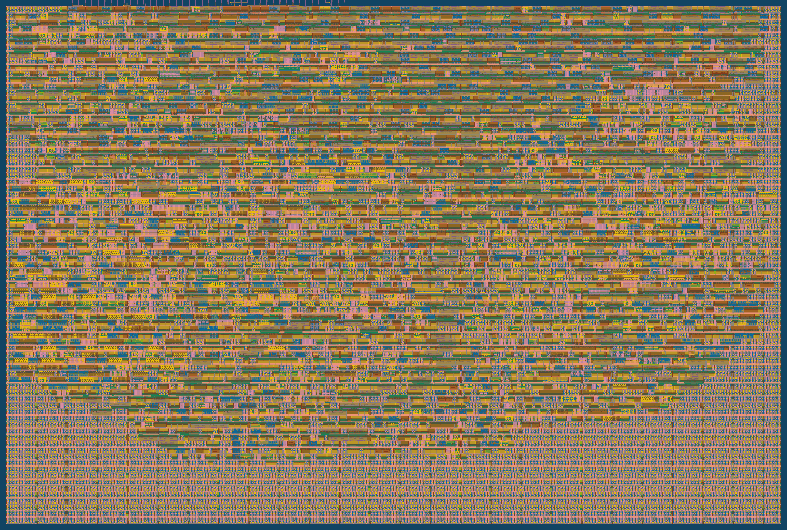
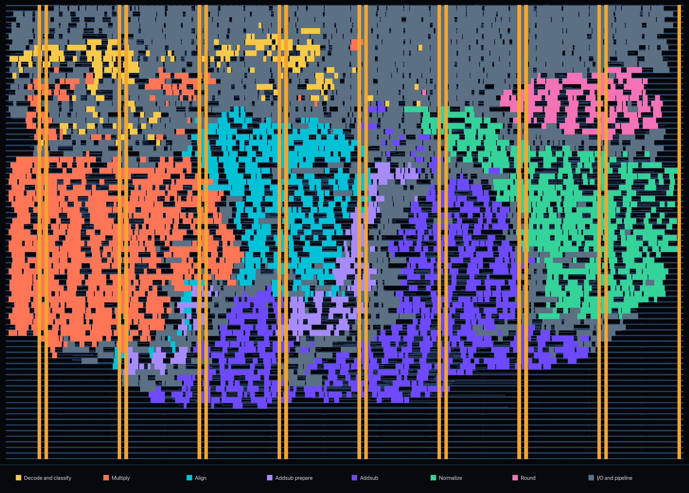

   

# BFloat16 Fused Multiply-Add (FMA) Unit

## What it does

This project implements a pipelined Bfloat16 Fused Multiply-Add unit. It calculates `a * b + c` without rounding the intermediate product, and then rounds the final result to Bfloat16. The name "fused" comes from combining the multiplication and addition into one operation with one rounding step. This single rounding helps us preserve the product in full precision and improves the accuracy of the final result.

## Placement 

## How it works

My implementation has six internal pipeline stages to reduce the critical path delay. This was especially useful for the tapeout because the limited I/O requires three clock cycles to load each set of operands. Without pipelining, the clock period would be limited by the delay of the entire arithmetic datapath, meaning that each of these three load cycles would also use the longer clock period. These pipeline stages are:

1) Decode and classify: Extract the sign, exponent, and fraction from each operand while identifying zero, infinity, and NaN special values
2) Multiply: Multiply the significands and calculate product's exponent and sign
3) Align and prepare for addition: Shift the addend based on the exponent difference between the addend and product
4) Add: Add or subtract the aligned magnitudes and determine sum's sign
5) Normalize: Find leading one, shift result to the top of the datapath and adjust its exponent
6) Round: Round the normalized result to Bfloat16 using round-to-nearest, ties-to-even (RNE), and output the final encoded value

## I/O Bottleneck

Each of the three Bfloat16 operands is 16 bits, so loading the three operands in a single cycle would require 48 input pins. The tapeout unfortunately doesn't have this bandwidth as it provides 8 input, 8 bidirectional, and 8 output pins. By using the bidirectional pins as inputs, the unit forms a 16-bit input loading bus and loads `a`, `b`, and `c` over three consecutive cycles. The 16-bit result is then sent over the 8-bit output bus in two cycles, with the low byte first and the high byte second. Operand loading continues while earlier transactions are in the pipeline or being output, so the design accepts one new FMA transaction every three clock cycles and doesn't need to wait for the previous transactions to complete.

## How to use

Hold `rst_n` low for at least one rising clock edge to reset the registers. Release the reset, and present the three operands in the order `a`, `b`, and `c` on consecutive rising edges. Each operand is concatenated as `{uio_in, ui_in}`, with `uio_in` as the high and `ui_in` as the low byte.

The result arrives seven cycles after `c` is loaded. The result's bytes arrive from `uo_out` in which the low byte is first and high byte is second. I couldn't add a valid interface due to the port constraints, so the result must be both sent and read according to the fixed timing relative to reset.

The input loader doesn't stop after one operation in which a new operand load sequence begins immediately after the previous transaction's `c` is loaded.

This is the example when calculating `1.5 * 2.0 + 0.5`:

| Input cycle | Value             | Meaning          |
| ---:        | ---:              | ---:             |
| 1           | `0x3FC0`          | `a = 1.5`        |
| 2           | `0x4000`          | `b = 2.0`        |
| 3           | `0x3F00`          | `c = 0.5`        |
| 10          | `uo_out = 0x60`   | Low result byte  |
| 11          | `uo_out = 0x40`   | High result byte |

The packed result is `0x4060`, which is `3.5` in Bfloat16.

## Verification

- 534 Tiny Tapeout wrapper-level directed and special-case vectors
- 100,534 FMA vectors + ~800K module specific vectors in the development repository
- Six-stage pipeline
- 133.33 MHz tapeout target
- 2x2 Tiny Tapeout tile

## Development repository

For more information on the implementation and testing, please visit the [development repository](https://github.com/akankaan/bf16-fma).
